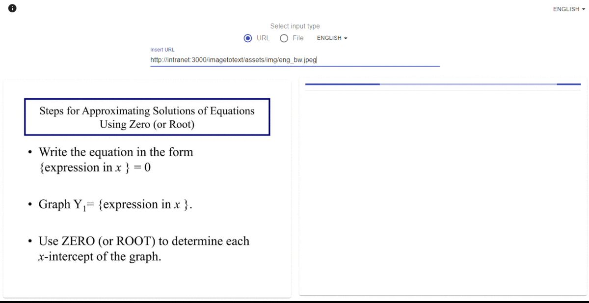

# PWA - Convert Image to Text using Javascript (tesseract.js library)

This is a small multi-language project built to use the frontend libraries and create an offline app that can be installed in any device. 

Use of different technologies such as:

#react #typescript #pwa #material-ui #tesseract-ocr #i18next

Features: 
* Paste image from Clipboard

[TODO]

* Add new option to convert images in backend (maybe using Node.js with the same library) (for tests purposes)
* Optimize speed using more workers
* Drag and Drop feature
* <del> Paste image from Clipboard feature </del>
* Add user authentication to be able to save results
* Routers & Redux 
* And 🤔...

# Below the demo Gif

 

Currently I've done the development in a subfolder ('/imagetotext/'). To run in the root folder remove the ("homepage": "/imagetotext/",) in the package.json file and in manifest.json (start_url & scope props). (Also remove the "set HOST=intranet&& " from scripts->start property in package.json)

Steps to install and start playing with the project:

1. git clone https://github.com/edisonneza/image-to-text.git
2. npm i
3. npm run start

To generate build files (by removing the source map files) 

* npm run winBuild
 
or <i>(if LINUX)</i>

* npm run build

# 👋

